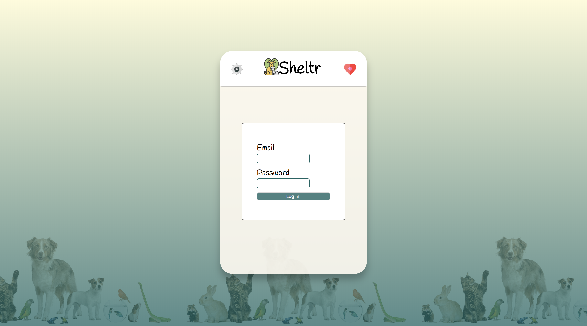
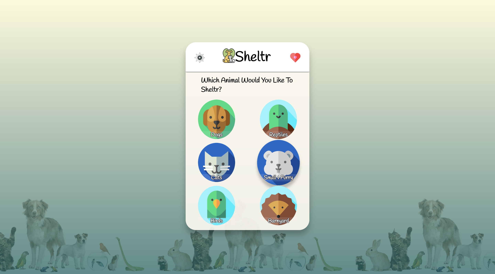
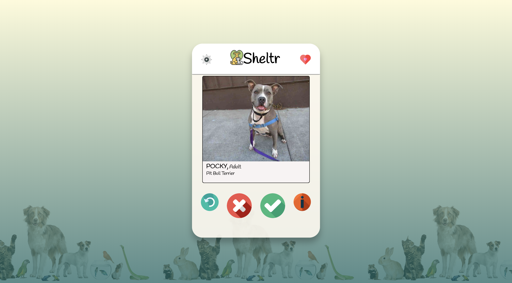
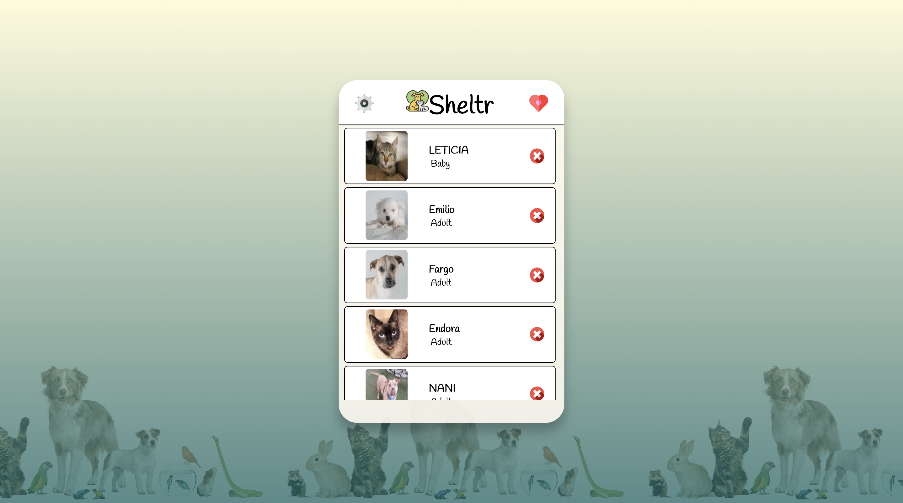
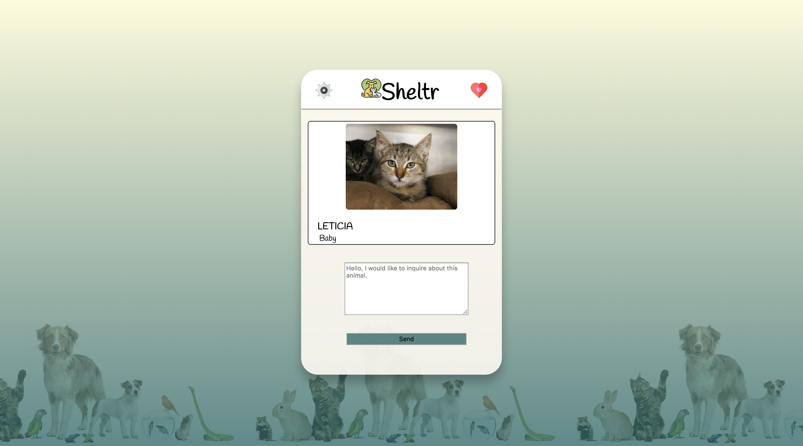

# Sheltr: A web app that connects users with pets that need homes 
This product is in progress.

## Table of Contents

1. [Description](#Description)
1. [Requirements](#Requirements)

## Description

Sheltr allows users to view shelter animals that are near them. By accessing the Petfinder API, the service is able to gather the animals based on type. The main feature of the app allows users to either swipe left or right, or click to like or unlike animals in the shelter. The animals that are liked are stored in a Postgres database, and are accessed when the users click the heart on the top right corner of the screen. Users can then choose an animal, and can directly email the shelter to inquire about the animal.

## Requirements
### To Run This Module

From within the root directory:
run npm install, then npm run start

## Images
<!-- .element height="50%" width="50%" -->
<!-- .element height="50%" width="50%" -->
<!-- .element height="50%" width="50%" -->
<!-- .element height="50%" width="50%" -->
<!-- .element height="50%" width="50%" -->